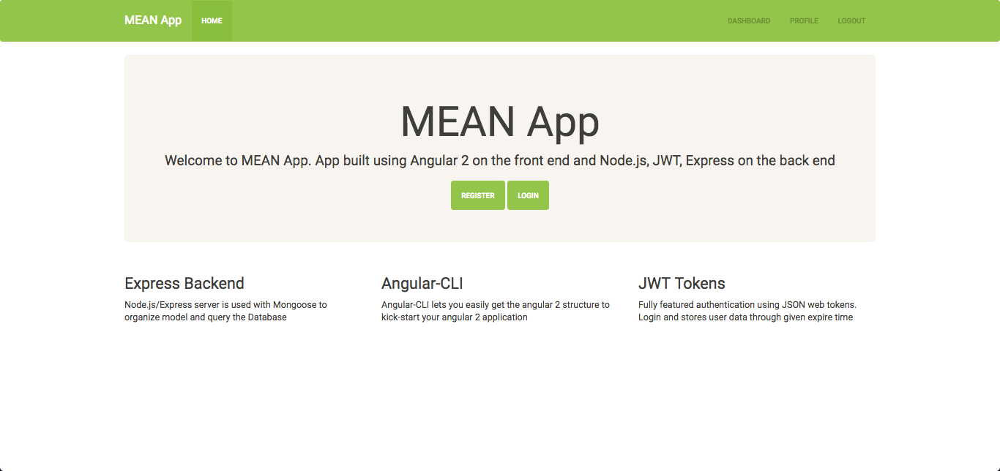
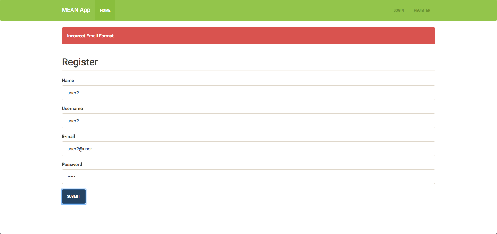
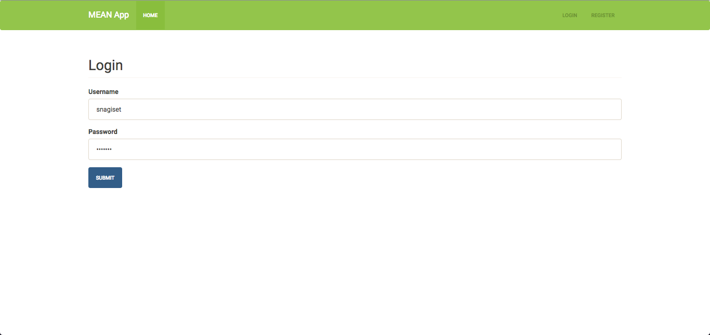
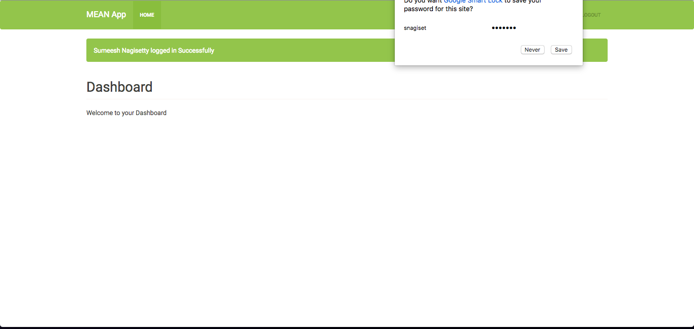
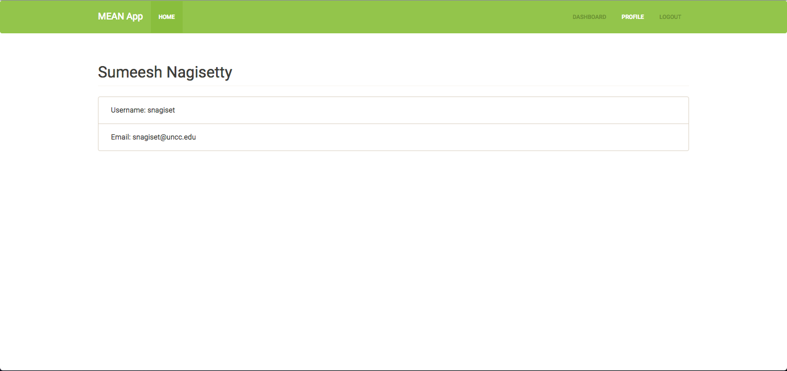

# MEAN STACK APPLICATION

Deployed on Heroku @ [NewsFirst](https://newsfirst.herokuapp.com/).

## How to Run

Run `npm install` to download all the required Node Modules. You can see `whatIsDone.txt` to know what technologies/framework are used in this application.

Once all the dependencies are installed. You can now go and start the application using the command `npm start`, which will start the application on port 3000 by default.

mongodb server is hosted on `mLab`

## What is done here?

This web application is a demostration of MEAN Stack application which uses Angular 2 CLI to load, manage and build angular 2 code with backend Node.js code.

This application will allow user to create an Account (Password is hashed by using `bcryptjs` and stored in database). Lets the user to login and go to user-specific pages are available only to the logged in person (Profile, Dashboard pages).

Dashboard has News Feeds from around 70 channel to choose from and User can have glance at top news story from all the channels.

Deployed on Heroku @ [NewsFirst](https://newsfirst.herokuapp.com/)

## How to Run

Run `npm install` to download all the required Node Modules. You can see `whatIsDone.txt` to know what technologies or framework are used in this application.

Once all the dependencies are installed. You can now go and start the application using the command `npm start`, which will start the application on port 3000 by default.

And make sure that mongodb server is ON on port 27017.

## What is done here?

This web application is a simple demostration of MEAN Stack application which uses Angular 2 CLI to load, manage and build angular 2 code with backend Node.js code.

As of now, this application will allow user to create an Account (Password is hashed by using `bcryptjs` and stored in database). Lets the user to login and go to user-specific pages are available only to the logged in person (Profile, Dashboard pages).

To maintain the session or to know that the user is logged in, JSON Web Token is used. Once the user logs in, JWT token and User is carried through out the session. And once the user logs out, token and user data will be cleared out.

### Models

MongoDB is used as the storage for all the user data. In this project, the database is hosted on `mlab` sandbox.

MongoDB is used as the storage for all the user data. In this project local database is established on default port 27017. 

As ODM, <strong>Mongoose</strong> is used with Node.js.

### Config

passwort-jwt module is used for authenticating. This module lets you authenticate endpoints using a JSON web token. It is intended to be used to secure RESTful endpoints without sessions.

### Routes

users.js has all the user links - Register, Login (authenticate), profile

### Link between Angular 2 and Backend Node module

By default Angular CLI is hosted on 4200 port. The request for register/login/user data is sent as a post or get request to the port 3000 (in this case) where backend code is running. 

Once the `ng build` is executed to build the angular 2 project. All the build artifacts will be stored in specified directory, `public/`. Once this is done, we will have a complete applicaiton running on port 3000 to do all the operations. 

# Screenshots

## Home Page

Home Page -  This is opening/welcome page to the application

## Registration Page

Register Page - Allows new user to create their account

## Login Page

Login Page - Allows registered user to login to the applicaiton

## Dashboard Page (As of now!)

Dashboard Page - Once user logs in, user will be redirected to dashboard

## Profile Page (Getting user data as of now!)

Profile Page - Gives the logged in User information
